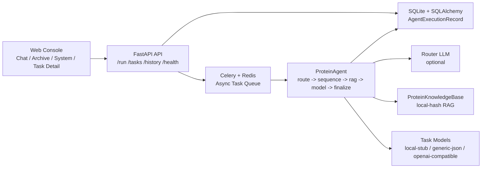

# ProteinAgent

`ProteinAgent` 不是一个“蛋白质小工具”，而是我为 `AI 应用工程 / Agent` 岗位准备的旗舰作品。  
它把一个垂直领域任务拆成完整的真实系统链路：

- 自然语言任务路由
- 模型网关与 provider 适配
- 蛋白领域 RAG
- 异步任务调度
- 执行轨迹追踪
- 历史记录持久化
- 多页面控制台展示

项目定位：

- 第一层：`垂直领域异步 AI Agent 编排系统`
- 第二层：`FastAPI + Celery + Redis + SQLite + Router LLM + RAG`
- 第三层：落地在 `多肽生成 / 适配体生成 / 蛋白预测`

## 为什么这个项目更像真实业务系统

很多学习项目只做到 “RAG 问答 + 单页面聊天”。  
`ProteinAgent` 往前多走了一步：

- `/run` 先返回 `task_id`，请求不阻塞
- worker 后台执行任务，状态通过 `/tasks/{task_id}` 轮询
- 执行过程写入 `trace_events`
- `route_source`、`router_output_text`、`rag_context`、`metrics` 都会落库
- `Archive / Task Detail` 页面可以回看历史任务，而不是一次性回答完就结束

这正好对应很多 `AI应用工程 / Agent` 岗位关注的点：  
`Python`、`FastAPI`、`RAG`、`Function Calling / Agent Workflow`、`数据库/缓存`、`模型接入`、`工程化状态管理`。

## 当前能力

### API

- `GET /health`
- `GET /models`
- `GET /knowledge`
- `POST /route`
- `POST /run`
- `GET /tasks/{task_id}`
- `GET /history`

### Agent 工作流

- 支持 `多肽生成 / 核酸适配体生成 / 蛋白预测` 三类任务
- 支持 `Router LLM -> 关键词 fallback` 双路由模式
- 支持蛋白序列抽取、规范化与合法性校验
- 支持 `local-hash` 离线 RAG
- 支持 `trace_events` 逐步记录执行轨迹
- 支持历史任务持久化与详情回放

### 前端展示

- `Chat`：提交任务并逐步展示执行轨迹
- `Archive`：查看历史任务
- `System`：查看模型、队列、知识库状态
- `Task Detail`：查看完整结果、指标、RAG 上下文与路由输出

## 架构



## 核心设计

### 1. 异步任务优先，而不是同步长请求

`/run` 只负责创建任务和返回 `task_id`。  
真正的执行放进 Celery worker 里完成，避免模型调用和 RAG 阻塞 HTTP 请求。

这让系统具备：

- 更稳定的前端交互
- 可轮询的任务状态
- 可持久化的执行结果
- 更接近真实 AI 工作流系统的形态

### 2. Router LLM 不作为唯一入口

项目支持：

- 优先使用 `Router LLM` 做自然语言任务识别
- Router LLM 失败时自动 fallback 到关键词路由

这不是为了炫技，而是为了让系统在真实模型不稳定时仍然可用。

### 3. RAG 不只服务于回答文本

RAG 返回的知识块不仅出现在结果文本里，也会进入：

- `rag_context`
- 历史记录
- 任务详情页

这样后续做评估、调试和展示时，可以看到“系统检索到了什么”，而不是只看到最后一句结果。

### 4. 失败态会被结构化落库

当前版本已经补齐两类关键失败路径：

- worker 执行失败
- 任务入队失败

失败时会写入：

- `status=FAILED`
- `error_message`
- `trace_events`
- `completed_at`

这让系统不至于出现“前端卡住，但数据库没有完整状态”的情况。

## 验证结果

### API / 单元测试

当前测试命令：

```bash
./.venv/bin/python -m unittest discover -s tests -v
```

当前通过：

- `30` 个测试

覆盖内容：

- 路由逻辑
- 序列抽取与规范化
- 知识库加载与检索
- API 健康检查
- `/run` 入队成功
- `/run` 入队失败
- `/tasks/{task_id}` 状态读取
- `/history` 历史记录返回
- 缺失序列导致的失败态落库

### 离线评测集

评测脚本：

```bash
./.venv/bin/python scripts/run_eval.py --write-report evals/latest_report.md
```

评测报告：

- [evals/latest_report.md](/Users/alakazan/Documents/Playground/求职/proteinAgent/evals/latest_report.md)

当前离线评测结果：

- 数据集规模：`30` 条 query
- 路由正确率：`24/24 (100.0%)`
- 任务成功率：`24/24 (100.0%)`
- 负样例识别率：`6/6 (100.0%)`
- Router fallback 覆盖：`6/6 (100.0%)`

评测覆盖：

- `3` 类任务
- `6` 条 Router LLM 失败回退场景
- `3` 条歧义路由场景
- `3` 条缺失序列场景

## Demo

固定 demo 输入：

- [demo/demo_cases.md](/Users/alakazan/Documents/Playground/求职/proteinAgent/demo/demo_cases.md)

录屏脚本：

- [demo/recording_script.md](/Users/alakazan/Documents/Playground/求职/proteinAgent/demo/recording_script.md)

推荐演示顺序：

1. 打开 `/system`，展示数据库、队列、模型和知识库状态
2. 在 `/chat` 演示一个多肽生成任务
3. 打开任务详情页，展示 `trace_events / route_source / metrics / rag_context`
4. 在 `/archive` 展示历史任务可回放

## 目录结构

```text
proteinAgent/
├── app/
│   ├── agent.py
│   ├── config.py
│   ├── database.py
│   ├── knowledge_base.py
│   ├── main.py
│   ├── model_clients.py
│   ├── models.py
│   ├── router.py
│   ├── schemas.py
│   ├── sequence_utils.py
│   ├── worker.py
│   └── static/
├── demo/
├── evals/
├── scripts/
├── tests/
├── docker-compose.yml
└── Dockerfile
```

## 本地运行

### 1. 安装依赖

```bash
./.venv/bin/python -m pip install -r requirements.txt
```

### 2. 启动依赖

```bash
docker-compose up -d redis
```

### 3. 启动 Web

```bash
./.venv/bin/python -m uvicorn app.main:app --reload
```

### 4. 启动 Worker

```bash
./.venv/bin/python -m celery -A app.worker.celery_app worker --loglevel=info
```

如果只做离线演示，可以使用 `local-stub` 任务模型，避免依赖真实模型服务。

## 简历写法建议

推荐项目名：

- `ProteinAgent：垂直领域异步 AI Agent 编排系统`

推荐 bullet 结构：

1. 将同步原型升级为 `FastAPI + Celery + Redis + SQLite` 的异步任务系统，支持 `task_id` 轮询、历史记录落库与失败态追踪。
2. 设计 `Router LLM + 关键词 fallback + 蛋白领域 RAG` 的 Agent 工作流，覆盖多肽生成、适配体生成和蛋白预测三类任务。
3. 实现 `trace_events / route_source / router_output_text / rag_context` 的全链路可观测输出，并提供 `Chat / Archive / System / Task Detail` 多页面控制台。
4. 补齐 `30` 个单元与 API 测试，以及 `30` 条离线评测集，验证路由、执行成功率和错误路径的稳定性。

## 当前边界

- 当前默认持久化仍是 `SQLite`，不是生产级数据库
- 任务模型默认以 `local-stub` 演示为主，真实模型链路还需要继续接业务 API
- 当前评测主要是离线功能正确性，不是线上真实业务效果评估
- 还没有接入更完整的 observability 平台

## 下一步

1. 对接真实多肽模型 API 与真实适配体模型 API
2. 补充固定 demo 截图和完整录屏
3. 视投递方向再决定是否切换到 `PostgreSQL`
